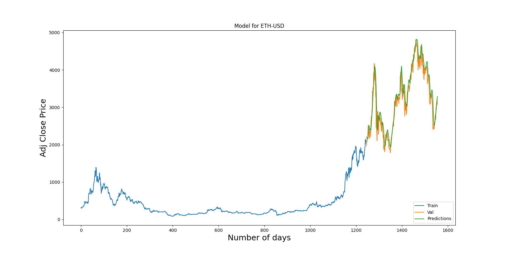

# Stock-Predictor-App
**
THIS IS NOT INVESTMENT ADVICE BUT IS RATHER MEANT TO BE USED FOR EDUCATIONAL PURPOSES AND FUN.  DO NOT USE THIS CODE FOR INVESTING PURPOSES.
**

  A project that is used for educational purposes to learn a foundation in Tkinter, Tensorflow, Scikit-learn, Pandas, Numpy and Matplotlib. 

## Setup
In order to run the code, you must install specific libraries:

   &ensp;&ensp;&ensp;&ensp;`$ Tensorflow==2.6.1`
   &ensp;&ensp;&ensp;&ensp;`$ numpy==1.18.5`
   &ensp;&ensp;&ensp;&ensp;`$ pandas==0.24.2`
   &ensp;&ensp;&ensp;&ensp;`$ scikit-learn==0.24.2`
   &ensp;&ensp;&ensp;&ensp;`$ matplotlib==3.3.4`
 
## Background
This code was created out of curiosity, I used 2 videos to create a solid foundation they are as follows:

 **&ensp;&ensp;&ensp;&ensp;[Stock Price Prediction Using Python & Machine Learning by Computer Science](https://www.youtube.com/watch?v=QIUxPv5PJOY&t=2632s)**
 This is video gave a foundation for the Machine Learning Algorithm to predict stock prices

 **&ensp;&ensp;&ensp;&ensp;[Build A Python GUI App Tutorial by Dev Ed](https://www.youtube.com/watch?v=jE-SpRI3K5g&t=562s)**
 This is video gave a foundation for Creating the GUI using Tkinter

 &ensp;&ensp;&ensp;&ensp;Due to my interest, I implemented a combination of these 2 tutorials and added some unique twists as well. These being that you will be able to save a png of the graph displayed at the end of the stock code, you will also save a unique model for each stock you have provided. There is also an option to save model checkpoints if you would like, and the code will automatically create a folder in the current directory which will contain the model information and graph if you choose to save it. 

## How to run the code
First you may want to go to [here](https://finance.yahoo.com/) and find stocks you would like to use for your run. Once you have chosen a Stock you would like to run, for example [ETH-USD](https://finance.yahoo.com/quote/ETH-USD?p=ETH-USD) you click on the Historical Data tab. Next, you can change the length of the data you would like, for [example](https://finance.yahoo.com/quote/ETH-USD/history?period1=1438819200&period2=1644624000&interval=1d&filter=history&frequency=1d&includeAdjustedClose=true) and then click Download. Now you will have a .csv file for the stock you would like. **I advise keeping the .csv file in a folder along with the code so that it will be easy to find.**

In order to run the code, you run the command:
  &ensp;&ensp;&ensp;&ensp;`$ python3 Stock_predictor_app.py`

  This code creates a GUI that will display on your screen, in the GUI you have 3 choices:

 &ensp;&ensp;&ensp;&ensp;Choose Stock .csv File
 &ensp;&ensp;&ensp;&ensp;Run Stock Analysis
 &ensp;&ensp;&ensp;&ensp;Remove Stocks

 &ensp;&ensp;&ensp;&ensp;These preform their corresponding tasks, for Choose Stock .csv File, File Explorer will open and you can upload one .csv file at a time, you can add as many .csv files as you would like. Once you have added the .csv files you would like you press Run Stock Analysis, this will train and test a model to predict the price of a stock. This will run for 20 Epochs and then prompt you to give a value of 1 or 2 for if you would like to save the graph for the model, the code will then display the graph for roughly 5 seconds then close and go to the next .csv file if more than one file was uploaded.

## Results

